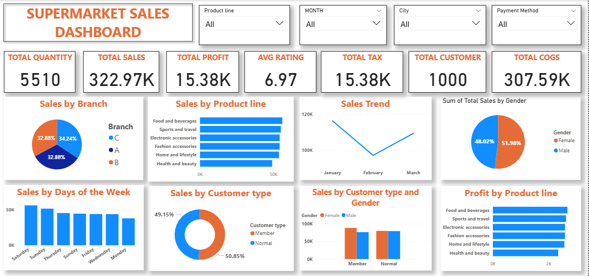

# 🛒 Supermarket Sales Analysis Dashboard (Jan–Mar 2019)

This project analyzes supermarket sales data over a three-month period to uncover insights into customer behavior, product performance, and branch-level profitability. Built using **Power BI**, the dashboard highlights key trends that inform inventory planning, marketing strategies, and operational decisions.

---

## 🔍 Executive Summary

**🎯 Objective:**  
Evaluate supermarket sales data to identify sales trends, top-performing product lines, and customer behavior insights across multiple branches.

**📌 Key Insights:**
- 💵 **Total Sales:** $322.97K  
- 📈 **Total Profit:** $15.38K  
- 🏪 **Top Revenue Branch:** Branch C (34.24% of total sales)  
- 🍽️ **Best-Selling Product Line:** Food and Beverages  
- 📅 **Highest Sales Day:** Saturday  
- 👥 **Customer Demographics:**  
  - Female: 51.98%  
  - Male: 48.02%  
- 🔑 **Customer Types:**  
  - Members: 49.15%  
  - Normal: 50.85%

**🛠 Recommendations:**
- Increase stock and marketing for **Food and Beverages**.
- Launch **loyalty incentives** targeting **Saturday shoppers**.
- Tailor pricing and promotions based on **gender and customer type** insights.

---

## 🧭 Business Context

**Background:**  
The supermarket chain seeks to understand key performance metrics, optimize product offerings, and improve customer targeting across three branches between January and March 2019.

**Stakeholders:**  
Retail Managers, Marketing Team, Finance Department, Store Branch Supervisors

**Key Business Questions:**
- What are the key sales and profit metrics?
- Which branches and product lines perform best?
- How do customer types and demographics impact revenue?

---

## 🗂️ Data Overview

- **📁 Source:** Supermarket POS system database  
- **📅 Date Range:** January – March 2019  
- **🔢 Fields Used:**  
  `Branch`, `Product Line`, `Sales`, `Profit`, `Quantity`, `Customer Type`, `Gender`, `Date`, `City`, `Payment Method`, `Rating`  

**📌 Data Notes:**
- Transaction records are assumed complete and accurate.
- Product categories and customer types are consistently labeled.

---

## 📊 Dashboard Overview

**Tool Used:** Power BI

### 🖼️ Key KPIs:
- Total Quantity Sold: **5,510**
- Total Sales: **$322.97K**
- Total Profit: **$15.38K**
- Average Rating: **6.97**
- Total Tax: **$15.38K**
- Total Customers: **1,000**
- Total Cost of Goods Sold (COGS): **$307.59K**

---

### 📍 Sales by Branch:
- **Branch C:** 34.24% (Top)
- Branch A: 32.88%
- Branch B: 32.88%

### 🍱 Sales by Product Line:
- Highest: **Food and Beverages**
- Others: Health & Beauty, Fashion Accessories, Sports & Travel, etc.

### 📈 Sales Trend Over Time:
- January: **Peak**
- February: **Dip**
- March: **Partial recovery**  
📝 *Suggests possible seasonal or promotional impact*

### 📆 Sales by Day of the Week:
- Highest: **Saturday**
- Lowest: **Monday**

### 🧑‍🤝‍🧑 Sales by Customer Type:
- **Members:** 49.15%
- **Normal Customers:** 50.85% (Very balanced)

### ⚥ Sales by Gender:
- Female: 51.98%
- Male: 48.02%

### 💰 Profit by Product Line:
1. Food and Beverages  
2. Fashion Accessories  
3. Health & Beauty  

---

## 💡 Strategic Recommendations

- **Double Down on Food and Beverages:** Leverage its sales and profit dominance with bundling and marketing.
- **Capitalize on Saturdays:** Introduce weekend specials and reward programs to boost repeat visits.
- **Tailor Gender-Based Marketing:** Subtle spending differences allow for segmented promotions.
- **Support Branch C:** Extend hours or expand stock to meet its high demand.
- **Investigate February Sales Dip:** Explore external factors (e.g., weather, holidays) to inform future strategies.

---

## 🧠 Skills & Tools Demonstrated

- Microsoft Power BI: Data modeling, DAX, slicers, charts
- Sales Data Analysis
- Customer Segmentation
- Retail Performance Metrics
- Business Reporting & Dashboard Design

---

## 📁 Files Included

- `Executive_Summary_Report.pdf` – Clean summary with visuals  

---

## 🙋‍♂️ About Me

**Oluwatobi Titilayo**  
Data Analyst | Power BI • Excel • SQL • Python  
[LinkedIn](https://www.linkedin.com/in/titilayo-oluwatobi/) | [GitHub](https://github.com/Oluwatobi-Data)

---

> _“Every number tells a story — I help businesses listen.”_

